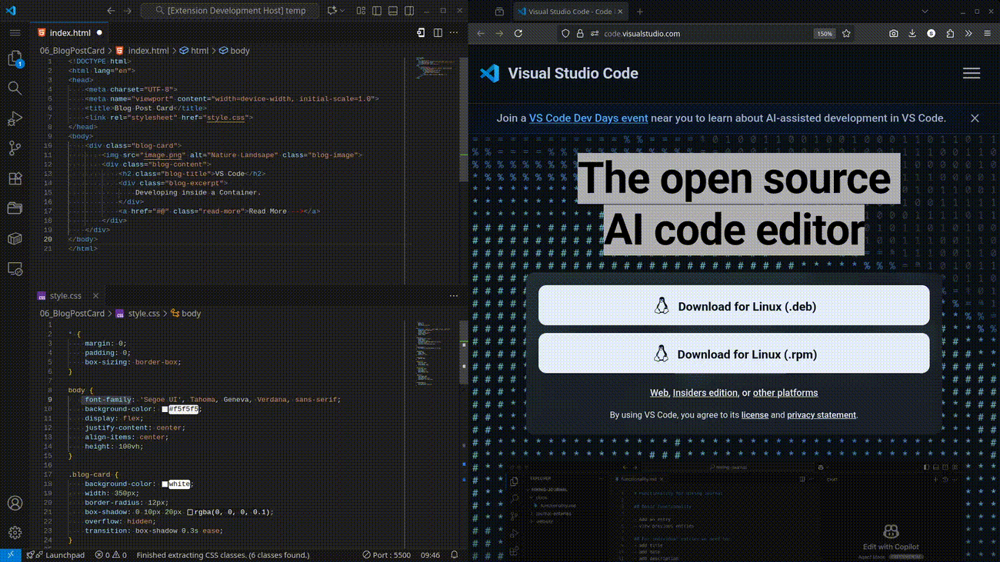
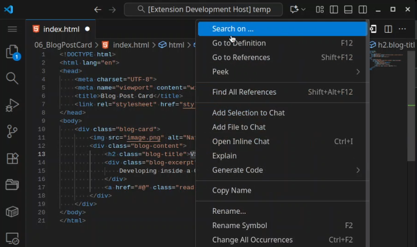
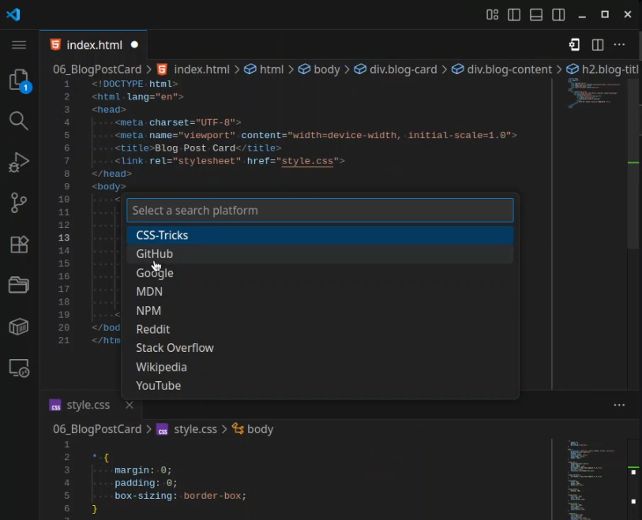

# Search On ...
**Search On ...** is an editor extension that allows developers to easily search selected text across multiple platforms. With this extension, you can quickly access information from websites like Google, GitHub, MDN, and many others.







## Included platforms
- Enable by default
  - Docker Hub
  - GitHub
  - Google
  - MDN (Mozilla Developer Network)
  - Microsoft Learn
  - NPM (Node Package Manager)
  - NuGet
  - Stack Overflow
  - Wikipedia
  - YouTube

- Disabled by default
  - Bing
  - crates.io
  - CSS-Tricks
  - dict.cc
  - Docs.rs
  - DuckDuckGo
  - Ecosia
  - Google Translator
  - Kotlin
  - PyPI
  - Python
  - Reddit
  - Startpage

## Settings

### Platforms
- All included platforms can be enabled/disabled in the settings.
- Call `Open settings` to go to a pre-filter settings page.


- Enable/disable platforms directly by calling `Enable platform` or `Disable platform`.


### Custom Platforms
- You can add your own platforms in the settings.
- On [GitHub](https://github.com/saxc/search-on/blob/main/Platforms.md) you can find a list of platforms that can be added.
- Optional `{{search_term}}` for the URL, if no `{{search_term}}` specified, it will be appended to the end of the URL.

Example settings
```json
"searchOn.customPlatforms": [
    { "label": "Google Translator", "url": "https://translate.google.com/?text={{search_term}}"},
    { "label": "Startpage", "url": "https://www.startpage.com/do/dsearch?q="},
    { "label": "Amazon", "url": "https://www.amazon.com/s?k="}
]
```

## Versioning
YY.MM.VERSION

- YY: Release year
- MM: Release month
- VERSION: Version in year/month